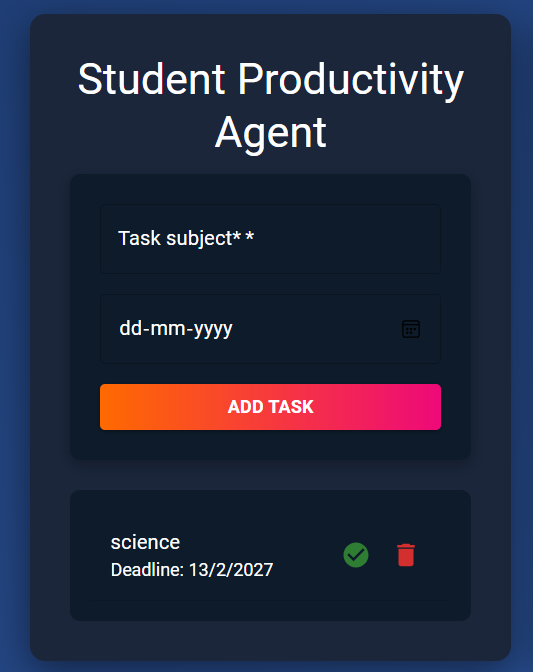
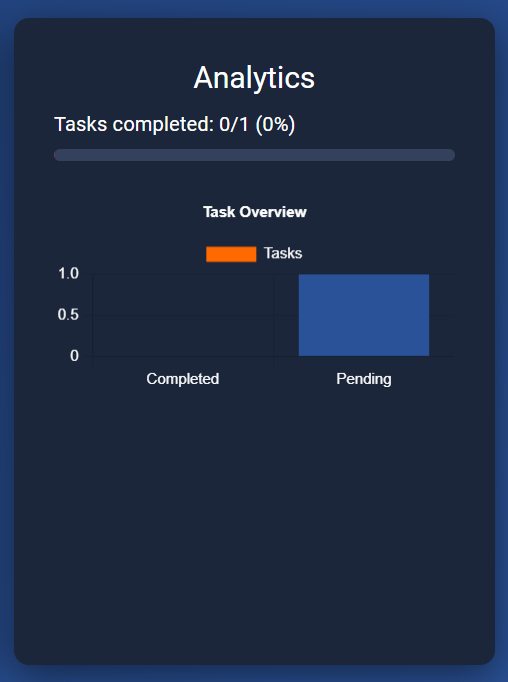

# 🎓 Student Productivity Agent

A full‑stack web application designed to help students manage tasks, track deadlines, and visualize productivity with analytics.

---

## 🚀 Features
- Add, update, and delete tasks with deadlines
- Mark tasks as completed
- Progress bar showing completion percentage
- Analytics dashboard with charts (Completed vs Pending)
- AI‑style reminders for overdue tasks
- Two‑panel layout: tasks on the left, analytics on the right
- Dark theme with modern UI (Material‑UI)

---

## 🛠 Tech Stack
- **Frontend:** React, Material‑UI
- **Backend:** Node.js, Express
- **Database:** MongoDB
- **Visualization:** Chart.js + react‑chartjs‑2
- **Deployment (optional):** Vercel/Netlify (frontend), Render/Heroku (backend), MongoDB Atlas

---


## ⚙️ Installation & Setup

### 1. Clone the repository
```bash
git clone https://github.com/yourusername/student-productivity-agent.git
cd student-productivity-agent

## 📸 Screenshots

### Dashboard Layout


### Analytics Panel



## 📂 Project Structure
student-productivity-agent/
├── backend/        # Express + MongoDB API
├── frontend/       # React + Material-UI client
├── screenshots/      
├── README.md       # Documentation


### 2.Backend setup
cd backend
npm install
npm start

### 3. Frontend setup
cd frontend
npm install
npm start
## 🔑 Environment Variables
Create a `.env` file in the backend folder with:
MONGO_URI=your_mongodb_connection_string
PORT=5000

## 📊 Usage
- Add a task with subject and deadline
- Mark tasks complete ✅ or delete 🗑️
- View progress bar and charts in Analytics panel
- Get reminders for overdue tasks


## 🌟 Future Improvements
- Add authentication (multi‑user support)
- Export tasks to CSV/Excel
- More chart types (pie chart, line chart for deadlines)
- Smart deadline predictions with ML


## 🤝 Contributing
Contributions are welcome!  
- Fork the repo  
- Create a new branch  
- Make your changes  
- Submit a pull request


## 📜 License
MIT License – free to use and modify.


